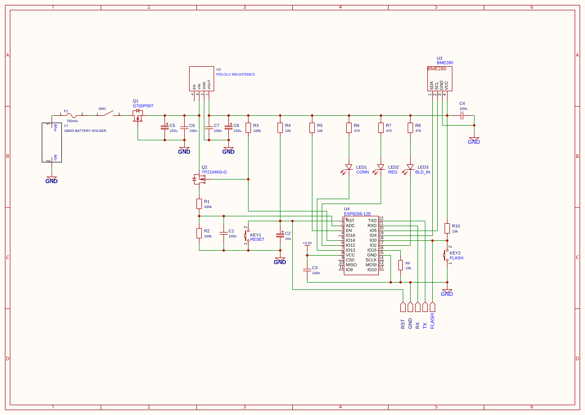

# Weather Station V1

## Overview

A battery-powered, IoT device built for reliable outdoor deployment within a durable, weather resistant enclosure.
It integrates sensors to monitor temperature, humidity, atmospheric pressure, and battery level, all managed by an ESP8266 microcontroller.

## Schematic

## Measurements

### Environmental Monitoring

Ambient temperature, relative humidity, and atmospheric pressure are measured using a BME280 environmental sensor module (U3).
The sensor interfaces with the ESP8266 microcontroller over the I2C communication bus, enabling data acquisition with minimal pin usage.

### Batter Level

Battery voltage measurement is implemented using the ESP8266's internal analog-to-digital converter (ADC) via pin ADC0.
By sampling the Li-Ion battery voltage, the firmware estimates the remaining state of charge.

The ESP8266 ADC features a 10-bit resolution and an input voltage range of 0 to 1V.
Because a standard 1S Li-Ion battery operates across a higher voltage range (typically 3.0V to 4.2V),
a voltage divider comprising resistors R1 and R2 scales the voltage down to a safe operating range for the microcontroller (0-0.98V).

To eliminate parasitic current leakage through the voltage divider network when idle, a P-MOS transistor (Q2) is integrated as a high-side load switch.
In its non-conducting state, its extremely high off-state impedance (in the gigaohm range) prevents static power consumption.
Without this switching mechanism, the continuous parasitic current draw (7-10uA depending on battery level) would significantly reduce battery operational lifespan,
as it can be substantial compared to the ~20 uA current drawn by the ESP8266 in deep sleep mode.
The P-MOS transistor must be switched on (driven into conduction) by the firmware immediately prior to acquiring the ADC sample.

The hardware for the battery level measurement system was heavily inspired by the
[Battery Voltage Monitoring breakout board](https://github.com/hallard/Battery-Voltage-Measure/blob/master/README.md) by
[Charles Hallard](https://github.com/hallard).

## Power Supply

A single-cell 18650 Li-Ion battery serves as the main power source for the board, secured in a dedicated holder (U1) for quick and easy replacement when discharged.

An onboard charging circuit was omitted to ensure continuous, uninterrupted operation of the station - swapping the battery on-site allows the device to remain deployed,
eliminating the need to bring the whole thing indoors for recharging.

For enhanced hardware safety, an 750mA PTC fuse (F1) protects the main board from overcurrent events,
complemented by a P-MOS transistor (Q1) configured for reverse polarity protection.

To regulate and normalize the battery voltage down to a stable 3.3V suitable for the ESP8266 and its surrounding components,
a Pololu S9V11F3S5C3 buck-boost converter (U2) is utilized. This specific regulator also protects the battery from over-discharge by featuring a built-in cut-off threshold at 3V.
Additionally, a capacitor (C5) is placed in the circuit to provide further voltage rectification and filtering.

## Firmware Upload and Debugging

For ease of development, both firmware programming and debugging are streamlined through a single, shared interface port combining UART,
FLASH, RESET, and GND lines into a single pin header compatible with the [ESP8266 programming board](./esp8266-programmer-v1.md).

AAdditionally, dedicated FLASH and RESET tactile switches are integrated directly onto the board.
These allow the ESP8266 IC to be manually forced into flashing mode (by pulling the FLASH pin low while toggling the RESET button to trigger a low-level pulse),
ensuring the flashing process is not restricted to a single programming board or method.

## Status Indicators
To provide visual feedback on system state, the board features three distinct status LEDs:

- CONN: Indicates Wi-Fi network association status. It utilizes inverted logic—remaining illuminated upon boot and turning
off once the ESP8266 successfully associates with the configured Wi-Fi network.
- REG: Indicates successful registration with the central server. Like the CONN indicator,
it employs inverted logic, starting in an illuminated state and turning off once the station completes its registration process.
- BLD_IN: The native onboard status LED of the ESP8266 module, which pulses dynamically during firmware flashing cycles and hardware resets.

The inverted logic for the CONN and REG indicators is intentionally designed to minimize continuous power consumption.
By keeping the LEDs turned off during normal, steady-state operational modes, unnecessary quiescent current draw is avoided, maximizing battery longevity.

## Prototype

### Overview

To ensure ease of manual soldering and prototyping, the board is designed entirely around through-hole technology (THT) components.

Because standard ESP8266 modules utilize surface-mount layouts, a 2.54 mm pitch adapter (raster board adapter) is incorporated to accommodate the module.
Note that the adapter board integrates essential pull-up/pull-down resistors for the CHIP_SELECT (GPIO15) and ENABLE pins, designated on the schematic as R5 and R9 respectively.

### Bill of Materials

The total cost of the prototype components is 147.65 PLN. A detailed breakdown is provided in the table below.
Please note that these prices reflect the market status as of 2026-09-19 - not wholesale rates - ensuring that a hobbyist can realistically build the prototype at this cost.
This BOM was prepared to roughly estimate which components are needed and how much it will cost to build the prototype device.

| No. | Designators        | Name                 | Value   | Description                               | Quantity | Store           | Price per Unit | Price     |
|:---:|:------------------:|:--------------------:|:-------:|:-----------------------------------------:|:--------:|:---------------:|:---------------|:---------:|
| 1   | C1, C3, C4, C6, C7 |                      | 100nF   | ceramic capacitor                         | 5        | [TME][No1]      | 0.87 PLN       | 4.35 PLN  |
| 2   | C2                 |                      | 10uF    | electrolytic capacitor                    | 1        | [TME][No2]      | 0.87 PLN       | 0.87 PLN  |
| 3   | C5, C8             |                      | 220uF   | electrolytic capacitor                    | 2        | [TME][No3]      | 1.12 PLN       | 2.24 PLN  |
| 4   | F1                 |                      | 750mA   | PTC fuse                                  | 1        | [TME][No4]      | 1.15 PLN       | 1.15 PLN  |
| 5   | KEY1, KEY2         |                      |         | 6x6 mm tactile switch                     | 2        | [TME][No5]      | 0.38 PLN       | 0.76 PLN  |
| 6   | LED1               |                      |         | 5mm red LED                               | 1        | [TME][No6]      | 1.38 PLN       | 1.38 PLN  |
| 7   | LED2               |                      |         | 5mm green LED                             | 1        | [TME][No7]      | 1.08 PLN       | 1.08 PLN  |
| 8   | LED3               |                      |         | built into ESP8266-12E                    |          |                 |                |           |
| 9   | Q1                 | G700P06T             |         | P-MOSFET transistor                       | 1        | [TME][No9]      | 3.34 PLN       | 3.34 PLN  |
| 10  | Q2                 | TP2104N3-G           |         | P-MOSFET transistor                       | 1        | [TME][No10]     | 2.82 PLN       | 2.82 PLN  |
| 11  | SW1                |                      |         | single-polde single-throw bistable switch | 1        |                 | 2.00 PLN       | 2.00 PLN  |
| 12  | U1                 |                      |         | 18650 battery holder                      | 1        | [Botland][No12] | 3.90 PLN       | 3.90 PLN  |
| 13  | U2                 | POLOLU S9V11F3S5C3   |         | DC-DC buck-boost converter module         | 1        | [Botland][No13] | 29.90 PLN      | 29.90 PLN |
| 14  | U3                 | BME280               |         | environmental sensor module               | 1        | [Botland][No14] | 34.90 PLN      | 34.90 PLN |
| 15  | U4                 | ESP8266-12E          |         | microcontroller                           | 1        | [Botland][No15] | 17.90 PLN      | 17.90 PLN |
| 16  | R1                 |                      | 330k    | carbon film resistor 0.25W 5%             | 1        |                 | 0.10 PLN       | 0.10 PLN  |
| 17  | R2, R3, R10        |                      | 100k    | carbon film resistor 0.25W 5%             | 3        |                 | 0.10 PLN       | 0.30 PLN  |
| 18  | R9                 |                      | 100k    | build into ESP8266-12E THT adapter board  | 1        |                 |                |           |
| 19  | R4                 |                      | 10k     | carbon film resistor 0.25W 5%             | 1        |                 | 0.10 PLN       | 0.10 PLN  |
| 20  | R5                 |                      | 10k     | build into ESP8266-12E THT adapter board  | 1        |                 |                |           |
| 21  | R6, R7             |                      | 470     | carbon film resistor 0.25W 5%             | 2        |                 | 0.10 PLN       | 0.20 PLN  |
| 22  | R8                 |                      | 470     | build into ESP8266-12E                    |          |                 |                |
| 23  |                    |                      |         | ESP8266-12E THT adapter board             | 1        | [Botland][No22] | 2.99 PLN       | 2.99 PLN  |
| 24  |                    | DFRobot FIT0099      |         | Universal PCB prototype board             | 1        | [Botland][No23] | 5.90 PLN       | 5.90 PLN  |
| 25  |                    |                      |         | male goldpin headers                      | 1        | [Botland][No24] | 0.49 PLN       | 0.49 PLN  |
| 26  |                    |                      |         | female goldpin headers                    | 1        | [Botland][No25] | 0.99 PLN       | 0.99 PLN  |
| 27  |                    | Samsung INR18650-35E | 3400mAh | 18650 li-ion battery                      | 1        | [Botland][No26] | 29.90 PLN      | 29.90 PLN |

*If no store offer URL is provided, the price is an estimate.

[No1]: https://www.tme.eu/pl/details/k104k10x7rf5ul2/kondensatory-ceramiczne/vishay/
[No2]: https://www.tme.eu/pl/details/eca1cm100i/kondensatory-elektrolityczne-tht/panasonic/
[No3]: https://www.tme.eu/pl/details/eca1cm221/kondensatory-elektrolityczne-tht/panasonic/
[No4]: https://www.tme.eu/pl/details/mf-r075/bezpieczniki-polimerowe-tht/bourns/
[No5]: https://www.tme.eu/pl/details/ts026660bk160lcrd/mikroprzelaczniki-tact/same-sky-r/ts02-66-60-bk-160-lcr-d/
[No6]: https://www.tme.eu/pl/details/fyl-5013srd1c/diody-led-tht-okragle/foryard/
[No7]: https://www.tme.eu/pl/details/ltl2r3kg/diody-led-tht-okragle/liteon/
[No9]: https://www.tme.eu/pl/details/g700p06t-gfs/tranzystory-z-kanalem-p-tht/goford-semiconductor/g700p06t/
[No10]: https://www.tme.eu/pl/details/tp2104n3-g/tranzystory-z-kanalem-p-tht/microchip-technology/
[No12]: https://botland.com.pl/koszyki-na-baterie/16516-koszyk-na-1-akumulator-typu-18650-bez-przewodow-5904422344597.html
[No13]: https://botland.com.pl/przetwornice-step-up-step-down/10676-s9v11f3s5c3-przetwornica-step-upstep-down-33v-15a-z-funkcja-odciecia-przy-niskim-napieciu-pololu-2873-5904422305789.html
[No14]: https://botland.com.pl/czujniki-cisnienia/11803-bme280-czujnik-wilgotnosci-temperatury-oraz-cisnienia-110kpa-i2cspi-33v-5904422366179.html
[No15]: https://botland.com.pl/moduly-wifi-esp8266/5463-modul-wifi-esp-12e-esp8266-black-11-gpio-adc-pcb-antena-5904422300616.html
[No23]: https://botland.com.pl/przejsciowki-smd-dip/4351-adapter-dla-modulu-wifi-esp-12e-esp8266-5904422332747.html
[No24]: https://botland.com.pl/plytki-uniwersalne/15088-plytka-prototypowa-uniwersalna-protoboard-572-pola-jednostronna-dfrobot-fit0099-5904422377786.html
[No25]: https://botland.com.pl/gniazda-szpilkowe-goldpin/20031-wtyk-goldpin-1x40-prosty-raster-254mm-czarny-10szt-justpi-5904422329198.html
[No26]: https://botland.com.pl/gniazda-szpilkowe-goldpin/20029-listwa-goldpin-1x40-zenska-raster-254mm-10szt-justpi-5904422329174.html
[No27]: https://botland.com.pl/akumulatory-li-ion/15216-ogniwo-18650-li-ion-samsung-inr18650-35e-3400mah-5904422343071.html

### Photos

TODO: Add photo of prototype PCB board when it will be ready.
